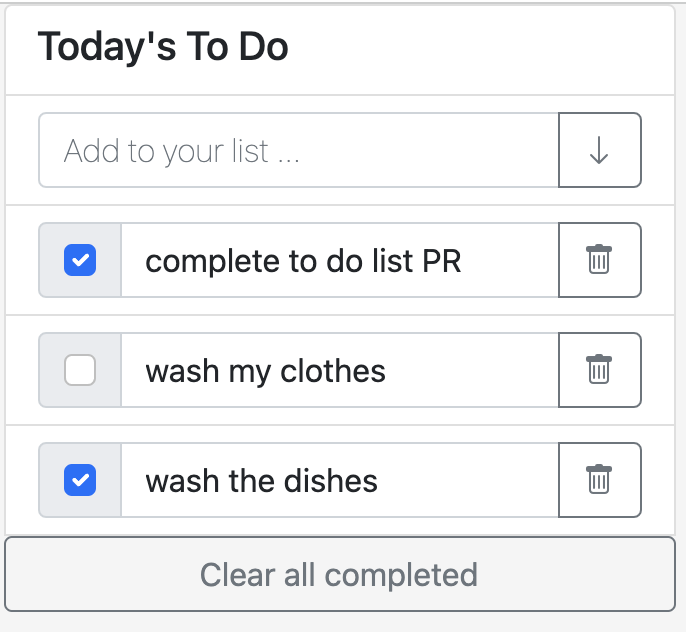

# WEBPACK BOILERPLATE

> This is a template to start a JS project using webpack.

Additional description about the project and its features.

## Built With

- HTML
- CSS
- JS

## Getting Started

**This is a template using webpack.**

To get a local copy up and running follow these simple example steps.

### Setup
https://webpack.js.org/guides/getting-started/

## Authors

👤 **Jasem Valencia**

- GitHub: [@JasemValencia](https://github.com/JasemDuncan)
- Twitter: [@JasemValencia](https://twitter.com/JasemValencia)
- LinkedIn: [@JasemValencia](https://www.linkedin.com/in/jasem-duncan-valencia/)

## 🤝 Contributing

Contributions, issues, and feature requests are welcome!

Feel free to check the [issues page](../../issues/).

## Show your support

Give a ⭐️ if you like this project!

## Acknowledgments

- Hat tip to anyone whose code was used
- Inspiration
- etc

## 📝 License

This project is [MIT](./MIT.md) licensed.
